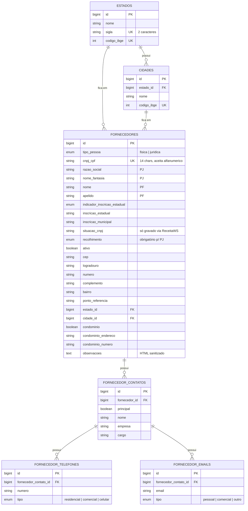

# Banco de dados

PostgreSQL 17. Todas as tabelas de domínio usam nomenclatura **pt-BR** (tabelas, colunas) — só os nomes de
classe/model ficam em inglês, por convenção do Laravel.

## Diagrama (ER)

> Tabela `usuarios` (autenticação) fica fora do diagrama por não se relacionar com o restante do domínio — não há
> coluna de autoria (`created_by`) nos fornecedores.

## Decisões de modelagem

- **Contato principal e contatos adicionais são a mesma tabela** (`fornecedor_contatos`), distinguidos só pela
  coluna `principal`. Evita duplicar schema para o mesmo conceito (nome/telefones/e-mails de um contato).
- **Enum sempre como coluna `enum` nativa**, nunca `string` solta — `tipo_pessoa`, `indicador_inscricao_estadual`,
  `recolhimento`, e os `tipo` de telefone/e-mail. O Postgres materializa isso como `CHECK` constraint; o valor
  permitido fica garantido pelo banco, não só pela validação da aplicação. A lista de valores é escrita direto na
  migration (não lida de `App\Enums\*`), porque uma migration é uma foto do schema num ponto do tempo — não deve
  depender de uma classe PHP que pode mudar depois.
- **Toda FK tem `cascadeOnDelete()`/`restrictOnDelete()` explícito.** `fornecedor_contatos`→`fornecedores` e
  `fornecedor_telefones`/`fornecedor_emails`→`fornecedor_contatos` cascateiam (apagar o fornecedor apaga tudo
  embaixo). `fornecedores`→`estados`/`cidades` é `RESTRICT` (não dá pra apagar um estado/cidade que tenha
  fornecedor vinculado).
- **Índice explícito em toda coluna de FK.** Diferente do MySQL/InnoDB, o Postgres **não** cria índice
  automaticamente ao adicionar uma `FOREIGN KEY` — sem o `$table->index(...)` explícito em cada migration, tanto
  o `CASCADE`/`RESTRICT` do delete quanto os joins/eager-loads do dia a dia fariam table scan.
- **`cnpj_cpf` é `unique` e aceita alfanumérico.** Suporta o novo formato de CNPJ alfanumérico da Receita Federal
  (ver [`DESTAQUES.md`](./DESTAQUES.md)) — por isso é `string(14)`, não um tipo numérico.
- **`situacao_cnpj` nunca é preenchido por input direto do usuário** — só é gravado quando vem de uma consulta
  real à ReceitaWS na mesma sessão (ver [`DESTAQUES.md`](./DESTAQUES.md)).

## Índices e constraints de busca

A listagem de fornecedores (grid) ordena por `razao_social`/`nome` e `nome_fantasia`/`apelido` via `COALESCE(...)`
— não são colunas reais, então não recebem índice dedicado; a allowlist de colunas ordenáveis
(`FornecedorRepository::COLUNAS_ORDENAVEIS`) é o que impede um nome de coluna arbitrário (potencial SQL injection)
de chegar num `orderByRaw()`.
